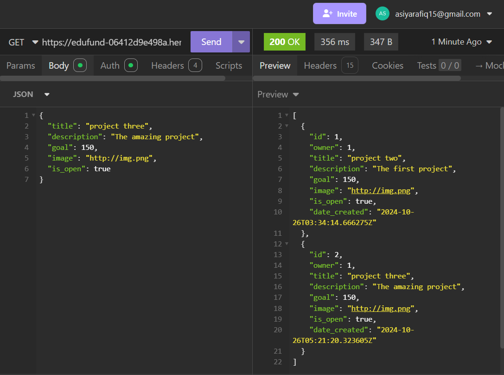
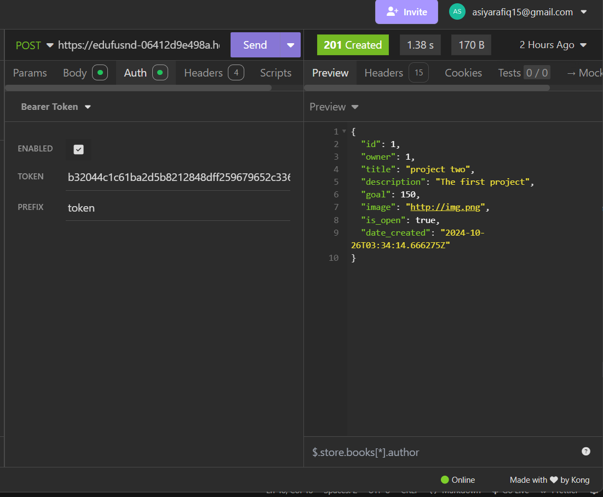
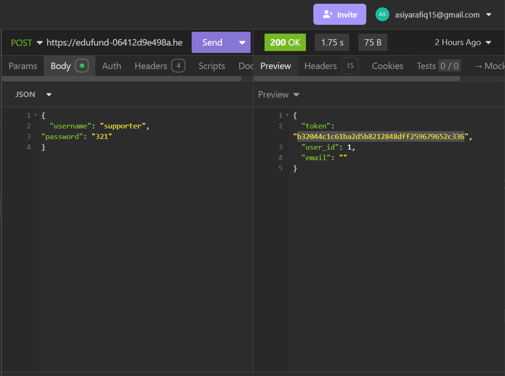

# Crowdfunding Back End

{{ Asiya Begum }}

## Planning:

### Concept/Name

{{ Edufund is an innovative crowdfunding platform dedicated to empowering schools and educational initiatives. By connecting supporters with creative projects, Edufund bridges the funding gap educators face.

Combining "education" and "funding," Edufund's mission is to provide essential financial support for projects that enhance learning. Our user-friendly interface allows easy browsing and sharing, while our transparency ensures contributors can see the impact of their donations.

Join us in redefining education funding—together, we can create a brighter future for every learner. With Edufund, we’re not just funding projects; we’re building dreams.}}

### Intended Audience/User Stories

{{ Who are your intended audience? How will they use the website?
Educators and Schools:

Usage: They will use the website to create and showcase projects seeking funding. This allows them to present their ideas and gather support from the community.
Students and Parents:

Usage: They can browse projects, contribute funds, and share initiatives within their networks. This helps foster a sense of community and support for educational growth.
Community Supporters and Donors:

Usage: Individuals who want to make a positive impact on education can explore various projects and make donations. They will also appreciate transparency regarding how their contributions are used.
Nonprofit Organizations and Educational Institutions:

Usage: These organizations can partner with Edufund to promote larger initiatives and reach a wider audience, facilitating collaborations and shared goals.
Corporate Sponsors:

Usage: Businesses looking to fulfill corporate social responsibility goals can support projects, potentially gaining visibility and goodwill in the community.
How They Will Use the Website
Project Creation: Educators will fill out forms to describe their projects, set funding goals, and upload images, making their initiatives appealing to potential supporters.
Browsing and Supporting: Users can easily navigate through various projects, filtering by categories, goals, or urgency, and choose to contribute financially or share with their networks.
Tracking Contributions: Supporters will have the ability to track how their donations are making an impact, seeing updates on project progress and outcomes.
Community Engagement: Users can leave comments, ask questions, and engage with project creators, fostering a sense of community and collaboration.
Transparency and Trust: The website will provide clear information on how funds are utilized, ensuring contributors feel confident in their support.
Through these features, Edufund aims to create an engaging and supportive environment for all users involved in the educational ecosystem. }}

### Front End Pages/Functionality

- {{ A page on the front end }}
  - {{ A list of dot-points showing functionality is available on this page }}
  - {{ etc }}
  - {{ etc }}
- {{ A second page available on the front end }}
  - {{ Another list of dot-points showing functionality }}
  - {{ etc }}

### API Spec

{{ Fill out the table below to define your endpoints. An example of what this might look like is shown at the bottom of the page.

It might look messy here in the PDF, but once it's rendered it looks very neat!

It can be helpful to keep the markdown preview open in VS Code so that you can see what you're typing more easily.

| URL                       | HTTP Method | Purpose                  | purpose                  | Request Body                                                                                                                | Success Response Code | Authentication/Authorisation  |
| ------------------------- | ----------- | ------------------------ | ------------------------ | --------------------------------------------------------------------------------------------------------------------------- | --------------------- | ----------------------------- |
| /api/users                | POST        | Create a new user        | Create a new user        | { "username": "supporter", "email": "email@.com", "password": "321" }                                                       | 201 Created           | None                          |
| /api/auth/login           | POST        | Authenticate user        | Authenticate user        | { "username": "supporter", "password": "321" }                                                                              | 200 OK                | None                          |
| /api/auth/token           | GET         | Retrieve user token      | Retrieve user token      | N/A                                                                                                                         | 200 OK                | Token required                |
| /api/projects             | POST        | Create a new project     | Create a new project     | { "title": "project three", "description": "The amazing project", "goal": 150, "image": "http://img.png", "is_open": true } | 201 Created           | Token required, project owner |
| /api/projects/{projectId} | GET         | Retrieve project details | Retrieve project details | N/A                                                                                                                         | 200 OK                | None                          |
| /api/projects             | GET         | List all projects        | List all projects        | N/A                                                                                                                         | 200 OK                | None                          |
| /api/projects/{projectId} | PUT         | Update project details   | Update project details   | { "description": "string", "isOpen": "boolean" }                                                                            | 200 OK                | 200 OK                        |
| /api/projects/{projectId} | DELETE      | Delete a project         | Delete a project         | N/A                                                                                                                         | 204 No Content        | Token required, project owner |
| /api/pledges              | POST        | Create a new pledge      | Create a new pledge      | { "project": 1, "amount": 50, "comment": "Love this project!", "anonymous": false }                                         | 201 Created           | Token required, user          |
| /api/pledges/{pledgeId}   | GET         | Retrieve pledge details  | Retrieve pledge details  | N/A                                                                                                                         | 200 OK                | None                          |
| /api/pledges/{pledgeId}   | DELETE      | Delete a pledge          | Delete a pledge          | N/A                                                                                                                         | 204 No Content        | Token required, pledge owner  |

### DB Schema ERD

[Deployed project] [https://edufund-06412d9e498a.herokuapp.com/]
[GET] 
[POST] 
[TOKEN] 
[New user,New Project] 
[ERD] 
